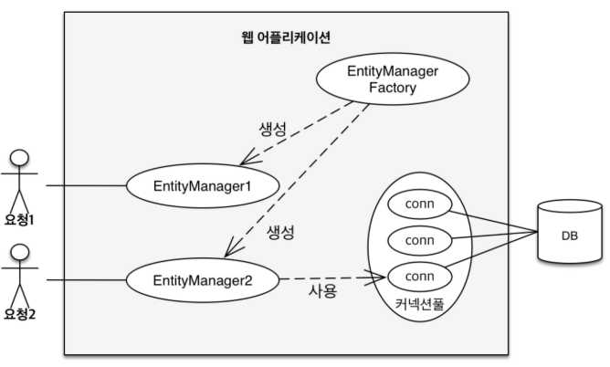

<!-- more -->

## EntityManager 란


-- 김영한_자바 ORM 표준 JPA 프로그래밍--

엔터티를 처리하기 위한 일련의 기능이 있다. getAll 을 포함해서 엔터티를 처리하기 위해서는 먼저 EntityManager 를 준비가 필요하다.\

### createQuery를 사용한 Query 작성

```
 Query query entityManager.createQuery("from 테이블");
```
엔터티를 가져오는 방법에 몇가지가 있지만 여기선 Query 클래스를 이용하고 있다. 
Query는 SQL 로 데이터베이스를 처리하는 쿼리 기능을 가진 클래스

'참고 : 스프링부트 프로그래밍 입문'
